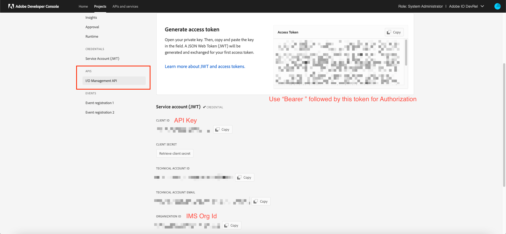

# Adobe I/O Events Journal Browser

Welcome to my Adobe I/O Application! This is a Project Firefly App. If you are not aware of Project Firefly App development, please refer to [Project Firefly Developer Guide](https://github.com/AdobeDocs/project-firefly).

## Background

- This is a Project Firefly App which enables users to browse through events from Journaling using a simple interface.

## Problem

- This has been requested by many developers who create journal-based event registrations. 
- Currently only a Journaling API endpoint URL is provided. Therefore, browsing events from Journaling is not convenient.

## Solution

- It uses [Adobe I/O Events Lib](https://github.com/adobe/aio-lib-events) to fetch events from Journaling when the user presses a button.
- Journal Browser provides a way to visualize Journaling. This can prove to be very useful to developers.
- Developers can go through the event payloads and the complete response headers with just a few clicks.

## Usage

- Use the Journaling URL from the Event Registration page in [I/O Console](console.adobe.io)
- Add the I/O Management API and generate a JWT token if not done already
- The credentials to be entered into the text fields can be found on the I/O Management API page in I/O Console:



## Quickstart

- Add required credentials in `.env` according to `dot_env`
- Use `aio app deploy` and follow the link to the deployed app in the Experience Cloud shell.
- This automatically gets the credentials required for the runtime action
- If you want to run this locally, uncomment the useEffect block in `web-src/src/components/ActionsForm.js` and add your own credentials from I/O Management API.

## Setup

- Populate the `.env` file in the project root and fill it as shown [below](#env)

## Local Dev

- `aio app run` to start your local Dev server
- App will run on `localhost:9080` by default

By default the UI will be served locally but actions will be deployed and served from Adobe I/O Runtime. To start a
local serverless stack and also run your actions locally use the `aio app run --local` option.

## Test & Coverage

- Run `aio app test` to run unit tests for ui and actions
- Run `aio app test -e` to run e2e tests

## Deploy & Cleanup

- `aio app deploy` to build and deploy all actions on Runtime and static files to CDN
- `aio app undeploy` to undeploy the app

## Config

### `.env`

```bash
# This file must not be committed to source control

## please provide your Adobe I/O Runtime credentials
# AIO_RUNTIME_AUTH=
# AIO_RUNTIME_NAMESPACE=
```

### `manifest.yml`

- List your backend actions under the `actions` field within the `__APP_PACKAGE__`
package placeholder. We will take care of replacing the package name placeholder
by your project name and version.
- For each action, use the `function` field to indicate the path to the action
code.
- More documentation for supported action fields can be found
[here](https://github.com/apache/incubator-openwhisk-wskdeploy/blob/master/specification/html/spec_actions.md#actions).

#### Action Dependencies

- You have two options to resolve your actions' dependencies:

  1. **Packaged action file**: Add your action's dependencies to the root
   `package.json` and install them using `npm install`. Then set the `function`
   field in `manifest.yml` to point to the **entry file** of your action
   folder. We will use `parcelJS` to package your code and dependencies into a
   single minified js file. The action will then be deployed as a single file.
   Use this method if you want to reduce the size of your actions.

  2. **Zipped action folder**: In the folder containing the action code add a
     `package.json` with the action's dependencies. Then set the `function`
     field in `manifest.yml` to point to the **folder** of that action. We will
     install the required dependencies within that directory and zip the folder
     before deploying it as a zipped action. Use this method if you want to keep
     your action's dependencies separated.

## Debugging in VS Code

While running your local server (`aio app run`), both UI and actions can be debugged, to do so open the vscode debugger
and select the debugging configuration called `WebAndActions`.
Alternatively, there are also debug configs for only UI and each separate action.

## Typescript support for UI

To use typescript use `.tsx` extension for react components and add a `tsconfig.json` 
and make sure you have the below config added
```
 {
  "compilerOptions": {
      "jsx": "react"
    }
  } 
```
